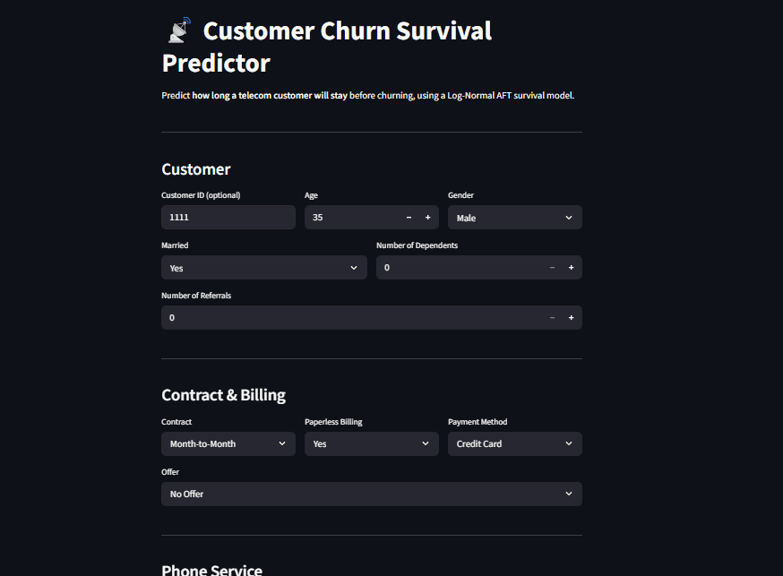

# Customer Churn Survival Analysis

A production-ready survival analysis system that predicts **how long a telecom customer will stay** before churning — not just *whether* they churn, but *when*.

Built with a Log-Normal Accelerated Failure Time (AFT) model, served via a FastAPI REST API, containerised with Docker, and deployed on Render.

<p align="center">
  
</p>

---

## Why Survival Analysis?

Traditional churn models output a binary probability: churn or not churn. Survival analysis goes further — it models **time-to-event**, producing a predicted median tenure in months for each customer.

This enables:
- Prioritising retention efforts on customers predicted to churn *soon*
- Quantifying expected lifetime value more accurately
- Understanding which factors *accelerate* or *decelerate* churn

---

## Model

| Property | Detail |
|---|---|
| Model | Log-Normal AFT (`lifelines.LogNormalAFTFitter`) |
| Target | Median predicted tenure (months) |
| CV C-index | ~0.83 |
| Training set | 80% of 7,000+ telecom customers |
| Holdout C-index | Evaluated in `notebooks/aft_model.ipynb` |

A **Cox Proportional Hazards** model was also built for research and assumption validation (`notebooks/cox_model.ipynb`).

---

## Project Structure

```
├── src/
│   ├── cleaning.py            # Raw data cleaning pipeline
│   ├── feature_engineering.py # Encoding for AFT/Cox models
│   ├── predict.py             # End-to-end prediction pipeline
│   └── config.py              # Centralised config loader
├── api/
│   ├── main.py                # FastAPI app
│   └── schemas.py             # Pydantic request/response models
├── models/
│   ├── aft_model.pkl          # Trained AFT model
│   └── aft_model_metadata.json
├── notebooks/
│   ├── train_aft_model.ipynb  # Model training + holdout split
│   ├── aft_model.ipynb        # Diagnostics + holdout evaluation
│   ├── cox_model.ipynb        # Cox PH model (research)
│   ├── cleaning_nb.ipynb      # Cleaning pipeline notebook
│   └── feature_engineering_nb.ipynb
├── tests/                     # 18 pytest tests
├── streamlit_app.py           # Streamlit UI (calls Render API)
├── config.yaml                # Single source of truth for paths + model config
├── Dockerfile
└── .github/workflows/ci.yml   # CI: test + Docker build
```

---

## API

### `GET /health`
```json
{ "status": "ok" }
```

### `POST /predict`

**Request:**
```json
{
  "Customer_ID": "CUST-001",
  "Age": 35,
  "Gender": "Male",
  "Married": "Yes",
  "Number_of_Dependents": 2,
  "Number_of_Referrals": 1,
  "Offer": "Offer A",
  "Phone_Service": "Yes",
  "Multiple_Lines": "No",
  "Avg_Monthly_Long_Distance_Charges": 20.5,
  "Internet_Service": "Yes",
  "Internet_Type": "Fiber Optic",
  "Avg_Monthly_GB_Download": 50.0,
  "Online_Security": "Yes",
  "Online_Backup": "No",
  "Device_Protection_Plan": "No",
  "Premium_Tech_Support": "Yes",
  "Streaming_TV": "No",
  "Streaming_Movies": "No",
  "Streaming_Music": "No",
  "Unlimited_Data": "Yes",
  "Contract": "One Year",
  "Paperless_Billing": "Yes",
  "Payment_Method": "Credit Card"
}
```

**Response:**
```json
{
  "Customer_ID": "CUST-001",
  "predicted_median_survival_months": 38.45
}
```

Interactive docs available at `/docs` (Swagger UI).

---

## UI

A Streamlit app (`streamlit_app.py`) provides a point-and-click interface for generating predictions without touching the API directly.

- Deployed on **Streamlit Cloud** (free tier)
- Calls the Render API via `POST /predict`
- Set the `API_URL` environment variable in Streamlit Cloud secrets to point to your Render service

**Run locally:**
```bash
pip install streamlit requests
API_URL=http://localhost:8000 streamlit run streamlit_app.py
```

---

## Run Locally

**Prerequisites:** Python 3.10+

```bash
# Install dependencies
pip install ".[dev]"

# Run tests
pytest tests/

# Start API
uvicorn api.main:app --reload
```

API available at `http://localhost:8000`

---

## Run with Docker

```bash
docker build -t churn-prediction .
docker run -p 8000:8000 churn-prediction
```

---

## Deployment

| Component | Platform | Notes |
|---|---|---|
| FastAPI backend | Render (Docker) | Auto-deploys on push to `main` |
| Streamlit UI | Streamlit Cloud | Connects to Render API via `API_URL` secret |

**Render** — detects `Dockerfile` automatically. Set start command:
```
uvicorn api.main:app --host 0.0.0.0 --port 8000
```

**Streamlit Cloud** — connect GitHub repo, set `streamlit_app.py` as the entry point, add secret:
```toml
API_URL = "https://<your-render-service>.onrender.com"
```

CI/CD via **GitHub Actions** — on every PR to `main`:
1. Installs dependencies
2. Runs all 18 pytest tests
3. Builds Docker image

---

## Data

Source: [Maven Analytics — Telecom Customer Churn](https://www.mavenanalytics.io/data-playground)

7,000+ telecom customers with service usage, contract details, and churn outcomes. Raw data is excluded from this repo — download and place at `data/raw/telecom_customer_churn.csv`, then run the cleaning and feature engineering notebooks.

---

## Retrain the Model

```bash
# 1. Run cleaning pipeline
jupyter nbconvert --to notebook --execute notebooks/cleaning_nb.ipynb

# 2. Run feature engineering
jupyter nbconvert --to notebook --execute notebooks/feature_engineering_nb.ipynb

# 3. Train model (80/20 split, saves holdout set)
jupyter nbconvert --to notebook --execute notebooks/train_aft_model.ipynb
```
